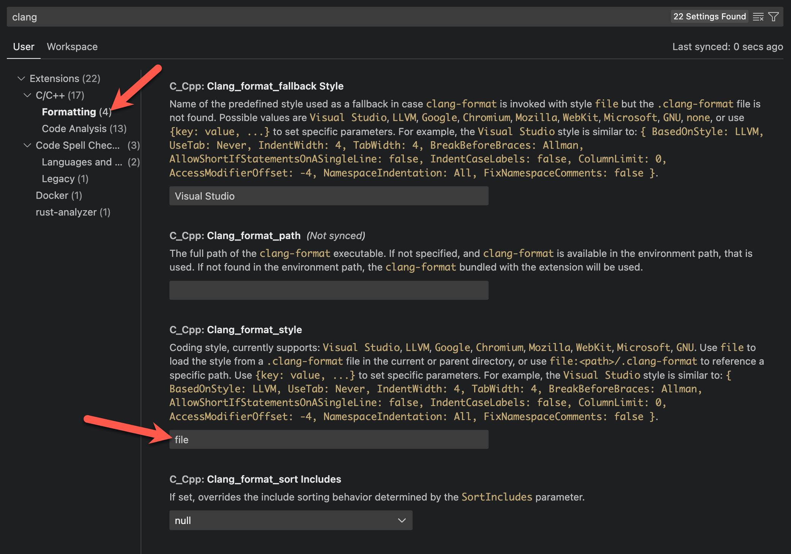
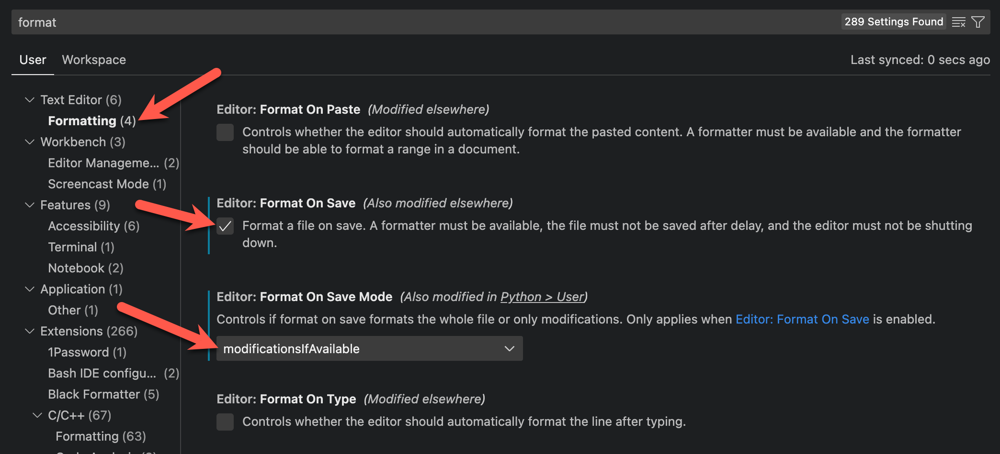

In this article, I'll describe how embedded firmware developers can leverage [`pre-commit`](https://pre-commit.com/) to automate and enforce code quality checks in their Zephyr RTOS embedded firmware projects.



This article is mainly focused on automating code quality tools in the context of a Zephyr *application* where the assumption is that everybody on the team has agreed upon using these tools (and ideally they are also enforced in CI).

Currently, `clang-format` formatting does not 100% align with the Zephyr project coding style, so you should be mindful when using `clang-format` on code that you're planning on upstreaming to the main Zephyr project.



## What's the problem?

To prevent back-and-forth discussions over code style and improve code quality, many embedded development teams have adopted a set of "coding style" guidelines. However, if these style guidelines are simply written down in a README or some other project documentation, it's inevitable that those guidelines will be ignored.

Phillip Johnston from [Embedded Artistry](https://embeddedartistry.com/) wrote an excellent article [Creating and Enforcing a Code Formatting Standard with clang-format](https://embeddedartistry.com/blog/2017/10/23/creating-and-enforcing-a-code-formatting-standard-with-clang-format/) with this quote from MongoDB that bears repeating here:

> **A formatting process which is both manual and insufficient is doomed to be abandoned.**

Phillip's article is a fantastic deep-dive on how to use the [`clang-format`](https://clang.llvm.org/docs/ClangFormat.html) tool to automatically format code to comply with code formatting guidelines encoded in a `.clang-format` config file. In a [follow up article](https://embeddedartistry.com/blog/2017/11/02/a-strategy-for-enforcing-formatting-with-your-build-server/), he describes how to enforce these rules on a build server in a CI environment to ensure that all changes are checked for formatting before they are merged into the main branch.

He also mentions that it's possible to enforce formatting checks in a local development environment using [git hooks](https://git-scm.com/book/en/v2/Customizing-Git-Git-Hooks), but points out the following caveat:

> […] the use of `git` hooks requires users to install the hooks on their end. It’s hard to fully enforce that flow, especially since you’re relying on developers to remember that hooks need to be installed.

The reality is that managing git hooks manually is painful and it's hard to enforce consistency across multiple developers, especially as those hooks change over time.

How do you make sure that everyone on your team is running the same set of checks?

## A case for using `pre-commit` in Zephyr projects

Fortunately, there is a fantastic tool called [`pre-commit`](https://pre-commit.com/) that can automatically install, manage, and run `git commit` hooks, without requiring individual developers to manage these hooks manually. By shipping a single `.pre-commit-config.yaml` config with your embedded project, you can make it trivially easy for individual developers to run code quality checks and automatically enforce code style rules in their development environment. *And this all happens before the code is checked into git*. This can help ensure that code submitted for peer review is consistently formatted and matches the agreed-upon code style for the project, allowing discussions to focus on the actual content of the changes without devolving into code style arguments.

In addition to checking for code style issues such as formatting and linting, `pre-commit` can be configured to run other types of checks (line-endings & whitespace, YAML file syntax issues, common code security issues, etc). There is a growing set of custom community-provided hooks in addition to the [ones provided out-of-the-box](https://github.com/pre-commit/pre-commit-hooks) by the developers.

For a great introduction to using `pre-commit` for embedded development in general, Noah Pendleton published an article on the Interrupt blog about how they [Automatically format and lint code with pre-commit](https://interrupt.memfault.com/blog/pre-commit) at Memfault.

At this point, you might be thinking "*I don't want to learn a new tool*" or "*I don't want to introduce additional dependencies*". However, I would argue that `pre-commit` actually simplifies the setup process for new developers vs. a manual approach.

First, if you're using Zephyr, you're probably already setting up a python virtual environment. Installing `pre-commit` for a Zephyr project is just two commands:

```sh
pip install pre-commit
pre-commit install
```

That's it! Once `pre-commit` is installed, the code quality checks will run automatically whenever a developer runs `git commit` in their local development environment. No more having to manually run checks before committing!

Second, if you're already using west manifest files to manage dependencies for your project's source code, you will find `.pre-commit-config.yaml` to be familiar in concept. Just as `west.yml` can be used to lock the specific revision for each source code dependency, the `.pre-commit-config.yaml` file is used to lock the specific revision for each code quality check you want to run. Just check this file into the git repo for your project, and all developers on your team will run the exact same set of checks.

## What checks should I run?

The Zephyr project [Coding Guidelines](https://docs.zephyrproject.org/latest/contribute/guidelines.html) recommend using `clang-format` with the provided [`.clang-format`](https://github.com/zephyrproject-rtos/zephyr/blob/main/.clang-format) config file to format code being contributed to the upstream Zephyr RTOS repository. In addition, coding style in the project is enforced using a modified version of the Linux kernel  `checkpatch` tool with the provided [`.checkpatch.conf`](https://github.com/zephyrproject-rtos/zephyr/blob/main/.checkpatch.conf) file. This is a good place for us to start.

The remainder of this article is going to describe how to configure `pre-commit` to automatically run `clang-format` and Zephyr's `checkpatch` before each `git commit`. This will flag (and sometimes automatically fix!) any code style issues present in our project code before we commit any changes.

If you don't already have existing code style guidelines required by your team or project, I would recommend simply copying [`.clang-format`](https://github.com/zephyrproject-rtos/zephyr/blob/main/.clang-format) and [`.checkpatch.conf`](https://github.com/zephyrproject-rtos/zephyr/blob/main/.checkpatch.conf) from the Zephyr project as a starting point. For example, if your project follows the recommended layout in the Zephyr [example-application](https://github.com/zephyrproject-rtos/example-application), you can copy these files into your application as follows:

```sh
cd example-application-workspace/
cp zephyr/.clang-format example-application/.clang-format
cp zephyr/.checkpatch.conf example-application/.checkpatch.conf
```



You'll need to change the following line in `.checkpatch.conf` to match the location of the `typedefsfile` file in your project (in this example, I'm just using the one included in the Zephyr repository):

```plaintext
--typedefsfile=../zephyr/scripts/checkpatch/typedefsfile
```

If this path is set up incorrectly, you'll get an error that looks like this:

```plaintext
No additional types will be considered - file '../foo/bar/typedefsfile': No such file or directory
```



Check these config files into the root of your project's git repository.

## How to configure `pre-commit` in a Zephyr project

Now that we've got the tool config files in our project repo, we can create a `pre-commit` config to run these checks. For the remainder of this article, I'm going to assume your project follows the recommended layout in the Zephyr [example-application](https://github.com/zephyrproject-rtos/example-application), but it should be simple to adapt this to your project layout.

First, we need to add an empty `pre-commit` config file to our project repo:

```plaintext
example-application-workspace/example-application/.pre-commit-config.yaml
```

`pre-commit` hooks are just git repositories and they are specified in the `.pre-commit-config.yaml` file as a list of values under the `repos` key. Each hook has a:

- `repo` key that contains the URL of the git repository
- `rev` key that contains the specific revision of the hook
- `hooks` key that describes the hooks to run (repos can contain multiple hooks)

Next, we'll add two hooks:

- one that runs `clang-format` (using the `.clang-format` config file we added earlier)

- one that runs Zephyr's `checkpatch` (using the `.checkpatch.conf` config file we added earlier):

```yaml
repos:
  - repo: https://github.com/pre-commit/mirrors-clang-format
    rev: v16.0.6
    hooks:
    - id: clang-format
  - repo: https://github.com/cgnd/zephyr-pre-commit-hooks
    rev: v0.1.2
    hooks:
    - id: zephyr-checkpatch
```



Unfortunately, Zephyr's checkpatch does not currently work on Windows 😿



Finally, check in the `.pre-commit-config.yaml` file into your project's git repository.

Now we're ready to install and run pre-commit.

## How to install and run pre-commit

As mentioned earlier, it's simple to install the `pre-commit` tool:

```sh
pip install pre-commit
```

Next, run the following command to install the git hooks:

```sh
cd example-application-workspace/example-application/
pre-commit install
```



NOTE: The `zephyr-checkpatch` hook we added requires that the [Zephyr environment scripts](https://docs.zephyrproject.org/latest/develop/env_vars.html#zephyr-environment-scripts) have been run. Run the following command to set up the Zephyr environment variables (this must be run for each new terminal session):

```sh
source example-application-workspace/zephyr/zephyr-env.sh
```



The hooks we've installed will run checks on any staged changes that we're trying to commit as part of a `git commit` session.

To show how this works, let's make some changes in the project's `main.c` to violate Zephyr's coding style:

```diff
 #include <zephyr/logging/log.h>
 LOG_MODULE_REGISTER(main, CONFIG_APP_LOG_LEVEL);

-int main(void)
-{
-       int ret;
+int main(void) {
+       int new;
        const struct device *sensor;

        printk("Zephyr Example Application %s\n", APP_VERSION_STRING);
```

Let's see what happens when we try to commit this change:

```plaintext
❯ git commit -m "Change variable name"
clang-format.............................................................Failed
- hook id: clang-format
- files were modified by this hook
Run Zephyr's checkpatch.pl...............................................Failed
- hook id: zephyr-checkpatch
- exit code: 1

-:11: ERROR:OPEN_BRACE: open brace '{' following function definitions go on the next line
#11: FILE: app/src/main.c:13:
+int main(void) {

- total: 1 errors, 0 warnings, 9 lines checked
```

In this example, both the `clang-format` and `checkpatch` checks failed. However, they automatically fixed the failing files for us!

You can see the files that were automatically fixed by running `git status`:

```plaintext
❯ git status
On branch pre-commit
Your branch is up to date with 'origin/pre-commit'.

Changes to be committed:
  (use "git restore --staged <file>..." to unstage)
        modified:   app/src/main.c

Changes not staged for commit:
  (use "git add <file>..." to update what will be committed)
  (use "git restore <file>..." to discard changes in working directory)
        modified:   app/src/main.c
```

To accept these formatting changes, we can just `git add` the modified files:

```plaintext
❯ git add -u
```

When we try to commit again, all the checks pass!

```plaintext
❯ git commit -m "Change variable name"
clang-format.............................................................Passed
Run Zephyr's checkpatch.pl...............................................Passed
[test 9facb95] Change variable name
 1 file changed, 1 insertion(+), 1 deletion(-)
```

## Update an existing codebase

As mentioned earlier, the hooks we've installed will only run checks on any staged changes that we're trying to commit as part of a `git commit` session, not all the files in a project. At this point, you may want to run `clang-format` and `checkpatch` on *ALL* the source code in your project to make sure it's compliant with the `pre-commit` checks moving forward.

Run the following command to run all the `pre-commit` hooks without doing a `git commit`:

```sh
pre-commit run --all-files
```

You might see output like the following:

```plaintext
❯ pre-commit run --all-files
clang-format.............................................................Failed
- hook id: clang-format
- files were modified by this hook
Run Zephyr's checkpatch.pl...............................................Passed
```

In this example, the `checkpatch` check passed but the `clang-format` check failed. However, it automatically fixed the failing files for us!

You can see the files that were automatically fixed by running `git status`:

```plaintext
❯ git status
On branch pre-commit
Your branch is up to date with 'origin/pre-commit'.

Changes not staged for commit:
  (use "git add <file>..." to update what will be committed)
  (use "git restore <file>..." to discard changes in working directory)
        modified:   drivers/sensor/examplesensor/examplesensor.c
        modified:   lib/custom_lib/custom_lib.c
        modified:   tests/lib/custom_lib/src/main.c
```

To accept these formatting changes, we can just `git add` the modified files:

``` plaintext
❯ git add -u
```

When we run `pre-commit` again, all the checks pass!

```plaintext
❯ pre-commit run --all-files
clang-format.............................................................Passed
Run Zephyr's checkpatch.pl...............................................Passed
```

Now, we can commit all the changed files in our project:

```plaintext
❯ git commit -m "Run pre-commit on all files"
clang-format.............................................................Passed
Run Zephyr's checkpatch.pl...............................................Passed
[test a0cfba7] Run pre-commit on all files
 3 files changed, 21 insertions(+), 29 deletions(-)
```

## Tips & Tricks

#### What to do when `clang-format` and `checkpatch` disagree

You may run into cases where Zephyr's `.clang-format` and `.checkpatch.conf` disagree on code style (in the Zephyr project, `clang-format` is [not intended to be a one-stop solution to all the code style issues](https://github.com/zephyrproject-rtos/zephyr/issues/52712#issuecomment-1516541794)).

For example, here's how `clang-format` will format the following code using Zephyr's `.clang-format`:

```C
static const struct divider_config divider_config = {
	.io_channel =
		{
			DT_IO_CHANNELS_INPUT(VBATT),
		},
	.power_gpios = GPIO_DT_SPEC_GET_OR(VBATT, power_gpios, {}),
	.output_ohm = DT_PROP(VBATT, output_ohms),
	.full_ohm = DT_PROP(VBATT, full_ohms),
};
```

If we try to commit this, `checkpatch` will fail because it thinks that the `{` should be on the same line as `.io_channel =`:

```plaintext
Run Zephyr's checkpatch.pl...............................................Failed
- hook id: zephyr-checkpatch
- exit code: 1

-:15: ERROR:OPEN_BRACE: that open brace { should be on the previous line
#15: FILE: src/battery_monitor/battery.c:87:
+       .io_channel =
+               {

- total: 1 errors, 0 warnings, 24 lines checked
```

You can resolve this conflict by using special comments to tell `clang-format` to skip formatting on certain lines in the file:

```C
static const struct divider_config divider_config = {
	/* clang-format off */
	.io_channel = {
		DT_IO_CHANNELS_INPUT(VBATT),
	},
	/* clang-format on */
	.power_gpios = GPIO_DT_SPEC_GET_OR(VBATT, power_gpios, {}),
	.output_ohm = DT_PROP(VBATT, output_ohms),
	.full_ohm = DT_PROP(VBATT, full_ohms),
};
```

Now, if you try to commit this, both `clang-format` and `checkpatch` checks will pass.

#### How to skip running `pre-commit` hooks if necessary

There may be times when `pre-commit` is failing but you need to commit anyway.

To skip all `pre-commit` hooks, add the `--no-verify` switch to the `git commit` command:

```sh
git commit --no-verify -m "foo"
```

To skip one or more hooks, you can set the `SKIP` environment variable to a comma separated list of hook ids:

```sh
SKIP=clang-format git commit -m "foo"
```

#### Automatically install `pre-commit` hooks when a repo is cloned

You can configure `git init` to automatically install `pre-commit` hooks when a new repository is cloned (rather than having to run `pre-commit install` manually).

Follow the recommended setup instructions at https://pre-commit.com/#pre-commit-init-templatedir

#### VS Code Integration

If you use VS Code, the [C/C++ extension](https://marketplace.visualstudio.com/items?itemName=ms-vscode.cpptools) from Microsoft enables running clang-format within the editor.

Make sure to set the `Clang_format_style` to `file` so that it loads your code style preferences from the `.clang-format` file in your project.



If you enable "Format on Save" and set "Format on Save Mode" to `modificationsIfAvailable`, the editor will attempt to run `clang-format` on save, but only on the parts of the file which have been modified (requires source control).



## Example Repo

If you would like to check out an example Zephyr application with a `pre-commit` config, I've added a [pre-commit branch](https://github.com/cgnd/example-application/tree/pre-commit) to my fork of the Zephyr `example-application` repo. Here's a direct link to the [`.pre-commit-config.yaml`](https://github.com/cgnd/example-application/blob/pre-commit/.pre-commit-config.yaml) file.

## Feedback

If you are using `pre-commit` (or something like it) as part of your embedded development workflow, let me know in the comments below! I'd love to learn more about how other embedded teams are using tools like this in their workflow.
