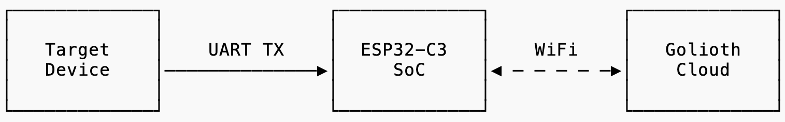
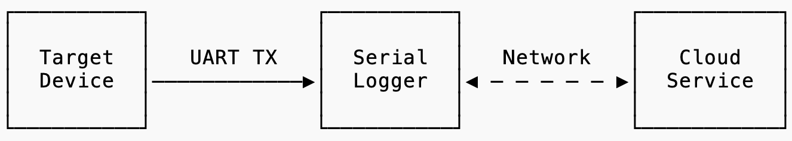
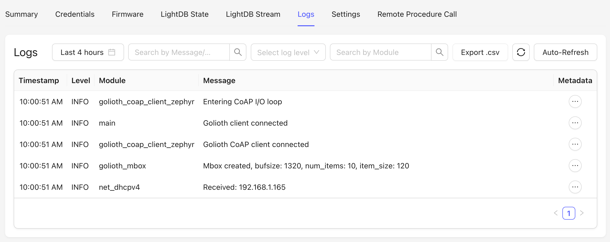
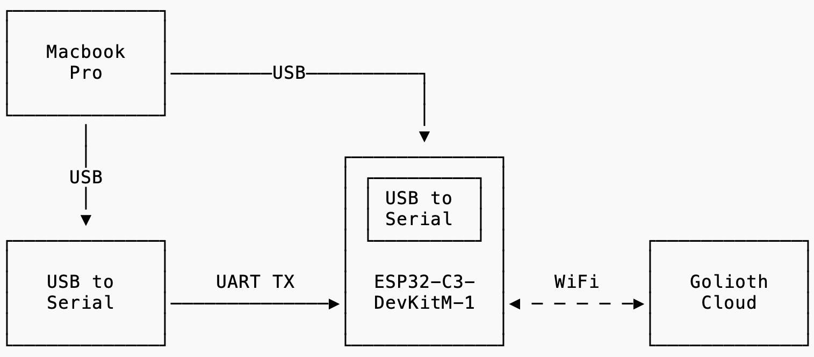
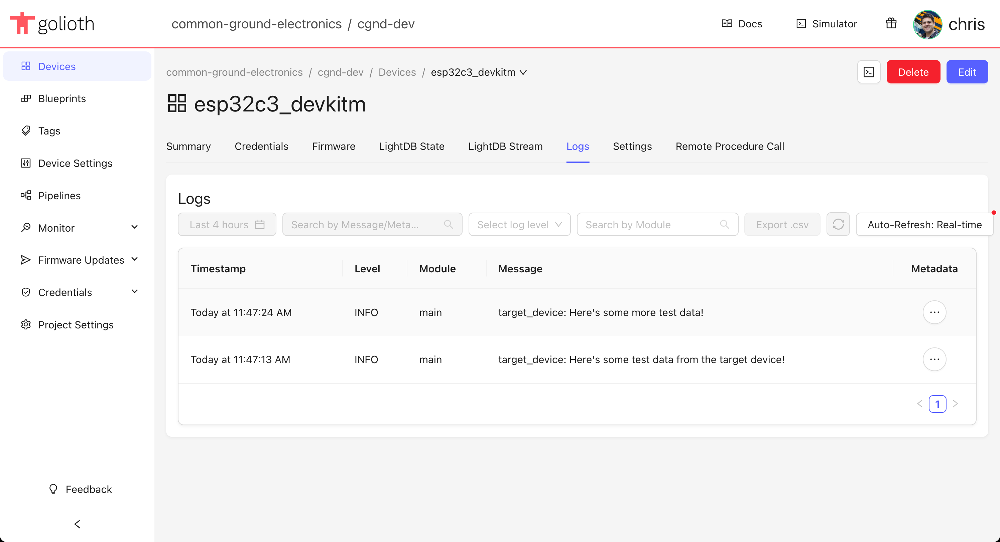

In this post, I'll show how I built a cloud-connected WiFi serial logger proof-of-concept in a couple hours (and for less than $10) by leveraging [Zephyr](https://www.zephyrproject.org/) and [Golioth](https://golioth.io/).

## Requirements

A couple days ago, one of the folks in the consulting forum on https://forum.contextualelectronics.com/ asked if anybody knew of an off-the-shelf device that could forward log messages from a generic target device to the cloud.

Here's the basic idea:

The requirements mentioned were:

- "Upload serial data to some cloud service"
- "Must have timestamps"
- "Preferably it will compress the data on the way"
- "It will be nice if the device can cache some data locally in case there is a disruption with the WiFi/Internet"
- "The cloud service should allow to download or view the logs based on date-time ranges."

I thought, "[this sounds like a neat idea!](https://xkcd.com/356/)" and gave myself a timeline of one day to see if I could string together a quick-n-dirty prototype using parts I already had on hand.

## Golioth's remote logging service

I had recently been doing some work with [Golioth](https://golioth.io/) and realized that Golioth's IoT device management and application services tick a lot of the boxes mentioned in the requirements above.

Specifically, Golioth has a built-in cloud [logging service](https://docs.golioth.io/device-management/logging/) which can be integrated into Zephyr's logging subsystem as a logging backend. This makes it possible to remotely monitor any log messages generated by a device in a web browser via the Golioth Console. The log messages are timestamped, you can export them as `.csv`, and it's possible to filter by log level, message metadata, etc.

## Hardware Setup

I had an [ESP32-C3-DevKitM-1](https://docs.espressif.com/projects/esp-idf/en/stable/esp32c3/hw-reference/esp32c3/user-guide-devkitm-1.html) lying around which seemed like a good candidate for building a WiFi serial logger proof-of-concept. The board has an [ESP32-C3](https://www.espressif.com/en/products/socs/esp32-c3) Soc with a 32-bit RISC-V single-core processor and a Wi-Fi (2.4 GHz band) radio.

To simulate a "target device", I connected a [TTL-232R-RPI](https://ftdichip.com/products/ttl-232r-rpi/) USB-to-UART cable to my laptop, but this could be any device that sends log messages out of a serial port.

## Firmware

The firmware for this proof-of-concept turned out to be pretty simple.

The `ESP32-C3-DevKitM-1` board is already [supported in Zephyr](https://github.com/zephyrproject-rtos/zephyr/tree/main/boards/espressif/esp32c3_devkitm), but the only UART enabled by default is `uart0` (which is connected to the onboard USB-to-serial converter). I needed a second UART to receive the log messages from the target device, so I had to add a `esp32c3_devkitm.overlay` file in my Zephyr app to enable `uart1`.

The firmware does the following things:

1. Sets up a UART interrupt and callback to process received characters from the UART port connected to the target device.
2. Connects to WiFi using credentials stored in the Zephyr settings subsystem.
3. Creates a secure connection to Golioth over WiFi using a Pre-Shared Key (PSK) stored in the Zephyr settings subsystem.
4. Receives characters from the UART until line end is detected (`\n` or `\r`), and puts the received line of data into a Zephyr message queue.
5. The `main` function waits until there is a message in the queue and calls Zephyr's `LOG_INF` macro to log the message via the logging subsystem.
6. Since I enabled the Golioth logging backend for the Zephyr logging subsystem (`CONFIG_LOG_BACKEND_GOLIOTH=y`), each log message is automatically forwarded to Golioth's logging service.

That's it! We've got log messages from the target device showing up in the cloud 🎉

You can check out the firmware on GitHub at https://github.com/cgnd/golioth-serial-logger

## Demo Time

Here's a quick video demonstrating how this works. In the video, you'll see me type a log message into the USB-to-UART converter (bottom right terminal window in the video), and the data shows up in the Golioth Console a second later.



## Why did I post this half-baked project?

It works, ship it! 🚀 (just kidding...)

Obviously this is not production firmware and has a bunch of limitations that would prevent you from using this as a reliable tool.

*So why am I sharing this now?*

First, I'm trying to build my "show your work" muscle 💪

I was inspired by seeing the [Demo Culture at Golioth](https://blog.golioth.io/demo-culture-at-golioth/) in action. In the past, I've been hesitant to share projects that are rough around the edges, but I'm learning that sharing what you're working on—before it's finished!—is a really powerful way to solicit feedback and trigger conversations about how something could be made better.

Second, I wanted to showcase how Zephyr + Golioth makes it possible to quickly prototype ideas.

I hacked this demo together in-between taking my kids to swim team, walking the dog, cooking dinner, plus a couple hours after everyone else went to bed. In his post [Wireframes are Cheap, Engineering Should Be Too](https://danielmangum.com/posts/wireframes-cheap-engineering-too/), Dan Mangum advocates for investing in infrastructure that reduces the cost and risk of involving engineering early in product development. Although he was referring to building software services, I think the concept can be extended to writing firmware and building hardware. I'm finding that Zephyr + Golioth is becoming a key part of my "infrastructure" that allows me to actually build and experiment with IoT ideas that would otherwise be too expensive to prototype.

## Feedback

Do you have a use case where a device like this would be helpful in your own work? Would you like to see continued development on this project?

If you enjoyed reading about this quick hack or found it helpful in any way, I would love to hear from you in the comments below!
