

Make sure to check out the follow up article [How to run Intel Quartus® Prime Lite Edition via Parallels on a Mac with Apple Silicon (ARM64)](https://cgnd.dev/posts/intel-quartus-prime-lite-edition-via-parallels-mac-apple-silicon-arm64/)



*Learn how to run Intel Quartus® Prime Lite Edition via Remote Desktop.*

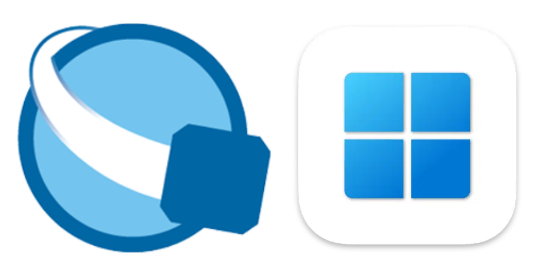

I recently obtained a [Terasic DE0-CV](https://www.terasic.com.tw/cgi-bin/page/archive.pl?Language=English&CategoryNo=163&No=921) FPGA dev board and needed to install/configure licensing for the accompanying [Intel® Quartus® Prime Lite Edition](https://www.intel.com/content/www/us/en/collections/products/fpga/software/downloads.html?s=Newest&edition=lite&f:guidetmD240C377263B4C70A4EA0E452D0182CA=%5BIntel%C2%AE%20Quartus%C2%AE%20Prime%20Design%20Software%3BIntel%C2%AE%20Quartus%C2%AE%20Prime%20Lite%20Edition%5D) FPGA design software.

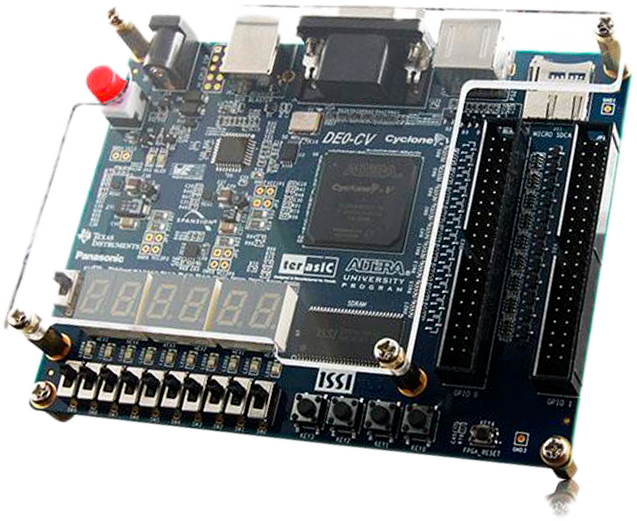

The Quartus Prime software [requires](https://www.intel.com/content/www/us/en/support/programmable/support-resources/design-software/os-support.html) an x86-64 machine running either Windows or Linux, but my laptop is an ARM-based Macbook Pro running macOS which is not supported.

However, I *do* have an old Intel-based Mac Mini that [runs Windows 10 via Bootcamp](https://support.apple.com/en-us/102622), so I ended up installing Quartus Prime on that machine. Not wanting to be tied to a desktop, I figured I'd just [Remote Desktop](https://apps.apple.com/us/app/windows-app/id1295203466?mt=12) into Windows from my MacBook Pro and run the tools remotely. *What could go wrong?*

## Trying and failing

After installing the software, I did a quick test to make sure I could launch Quartus and program the DE0-CV board via Remote Desktop. Everything seemed to work fine—until I tried to launch Questa...

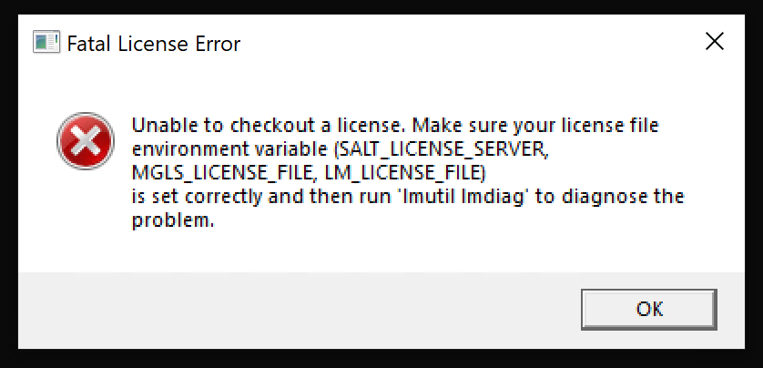

After a quick Google search, I discovered that while Quartus® Prime Lite Edition does not require a license, the bundled Questa\*-Intel® FPGA Starter Edition [does require a license key](https://www.intel.com/content/www/us/en/docs/programmable/683472/24-3/types-of-fpga-software-licenses.html). Additionally, [this page](https://www.intel.com/content/www/us/en/docs/programmable/683472/24-3/and-software-license.html) initially seemed to indicate it was not possible to use Questa\*-Intel® FPGA Starter Edition via Remote Desktop:

> The Questa*-Intel® FPGA Edition software license **does not support Remote Desktop access** with node-locked, uncounted licenses.

However, it turns out that while Remote Desktop is not supported with *node-locked* licenses, it is possible to request a free *floating* license for Questa\*-Intel® FPGA Starter Edition which allows running the software via Remote Desktop.

I couldn't find a guide online that covered how to set this up from start-to-finish, so here's the process I used to get it all working via Remote Desktop.

## Download Quartus® Prime Lite Edition

If you haven't already, download and install [Intel® Quartus® Prime Lite Edition](https://fpgasoftware.intel.com/?edition=lite). In this guide I installed [Version 23.1.1 for Windows](https://www.intel.com/content/www/us/en/software-kit/825278/intel-quartus-prime-lite-edition-design-software-version-23-1-1-for-windows.html). You'll need to [sign in](https://www.intel.com/apps/intel/services/unifiedlogin.html) or [register](https://www.intel.com/content/www/us/en/secure/forms/developer/premier-registration.html) for an Intel account if you haven't already.

## Request a license

Intel requires that you enroll in the [Intel® FPGA Self-Service Licensing Center (SSLC)](https://fpgasupport.intel.com/Licensing/license/index.html)  to request a license for Questa.



Enrollment in the SSLC is not instant; it took a couple hours before I received access after completing the enrollment request.



Once you have access, log in to the SSLC and click on "Sign up for Evaluation or No-Cost Licenses".

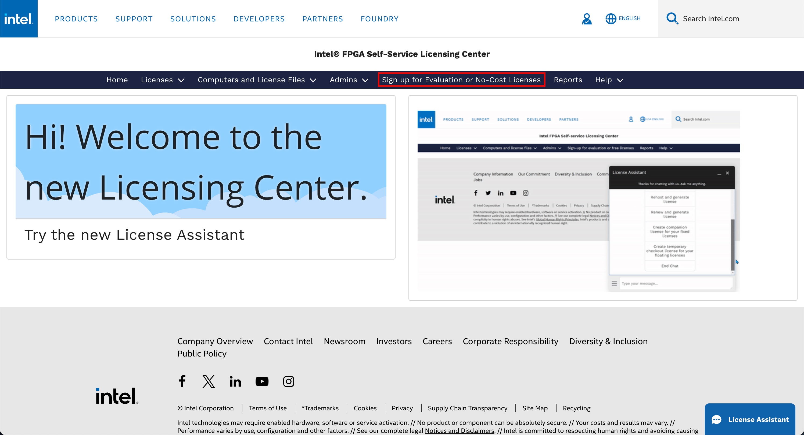

Choose the option for the `SW-QUESTA` license and click "Next".

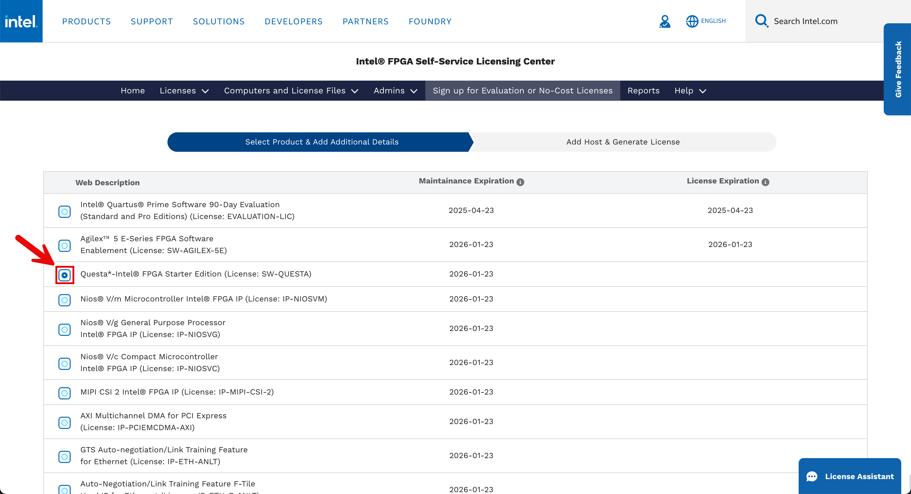

Click "+New Computer" to bring up the "Create Computer" modal. This will allow you to create a new computer profile for use in the licensing portal.

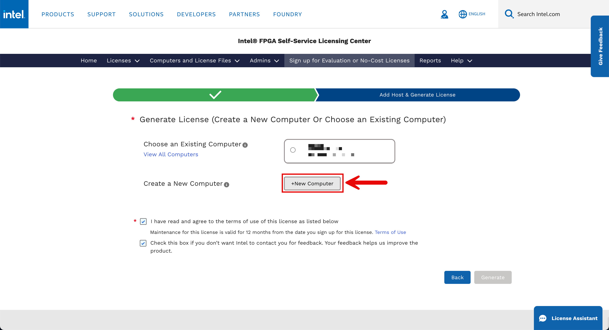

Input the hostname, set the "Computer Type" to "NIC ID", and specify the NIC ID (i.e. network card MAC address) for the Windows machine that will run the license server, and click "Save".

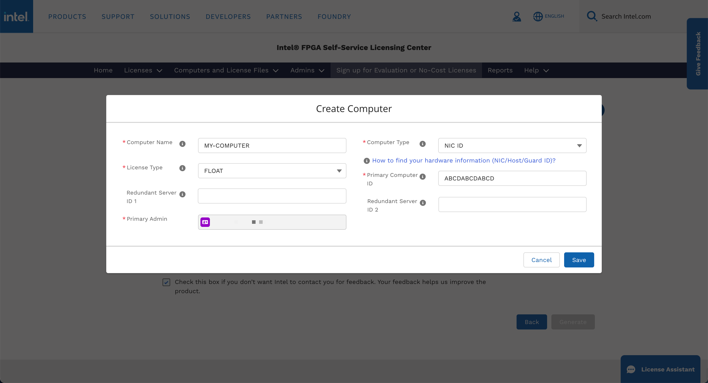

Once the computer profile has been created, select it and click "Generate" to generate the license file. A couple minutes later, you should receive a `LR-XXXXXX_License.dat` license file via email.

## Set up the license server

Copy the license file to the [recommended](https://www.intel.com/content/www/us/en/docs/programmable/683472/24-3/set-up-a-fixed-license-11345.html) location `C:\flexlm\LR-XXXXXX_License.dat`

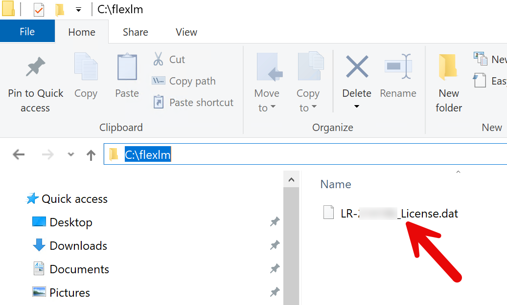

Edit the license file in a text editor to specify the hostname, NIC ID, and (optionally) port to use for the license server, as well as the path to the `mgcld` executable[^1].



If you don't specify a port for `SERVER`, it will default to `27000`. On Windows, it's [recommended](https://www.intel.com/content/www/us/en/docs/programmable/683472/24-3/set-up-a-license-file-in-the-license-server.html) to choose a port number outside of the `27000`-`28000` range, and unique on the machine. On Linux systems, the license manager automatically chooses a free port between `27000` and `27009`.



```plaintext
################################################################################
SERVER <HOSTNAME> <NIC ID> <PORT>
VENDOR mgcld C:\intelFPGA_lite\23.1std\questa_fse\win64\mgcld.exe
USE_SERVER
################################################################################
```

Once the license file is configured, start up `lmtools` and configure the service to start at boot up time:

```cmd
C:\intelFPGA_lite\23.1std\questa_fse\win64\lmtools.exe
```

Make sure "Configuration using Services" is checked:

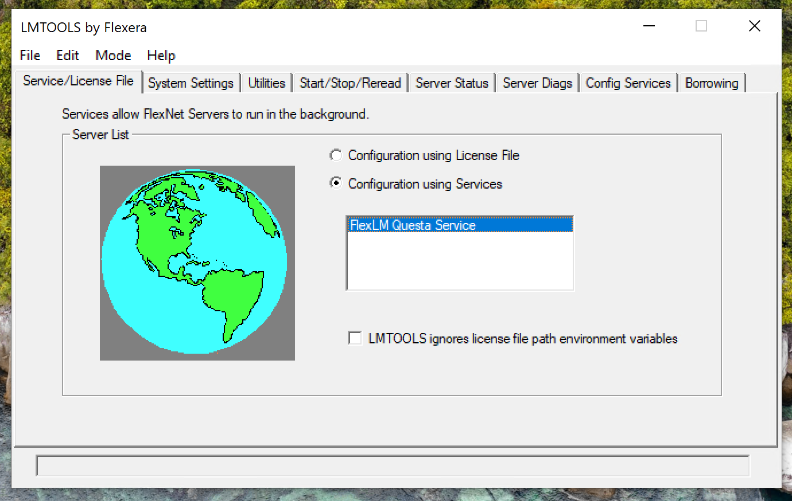

In the Config Services tab, make sure the correct paths are set and the service is configured to start at power up. (You can set the "Service Name" to whatever you want.)

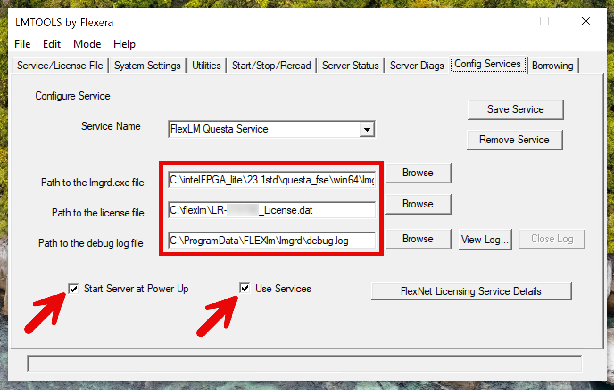

Finally, we need to configure the service so that Questa can be run locally on the same machine as the server:

 1. Type `services.msc` into the Windows search bar and hit enter.

 2. Navigate to the name of the Service that was created in LM Tools ("FlexLM Questa Service" in this example).

    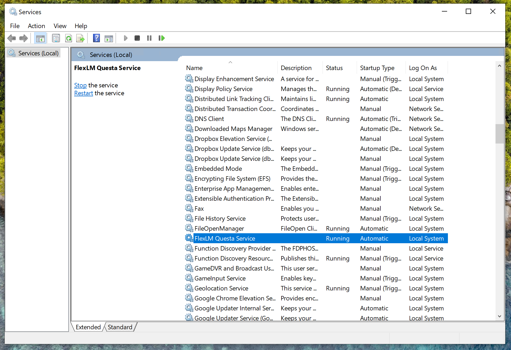

 3. Right-click it and select "Properties"

    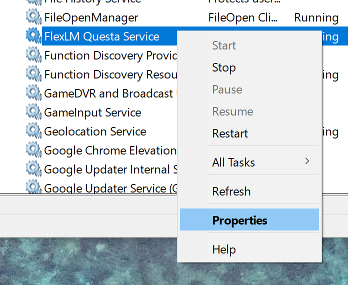

 4. Select the "Log On" tab.

 5. Change "Log on as:" to "Local System account" and select "Allow service to interact with desktop".

    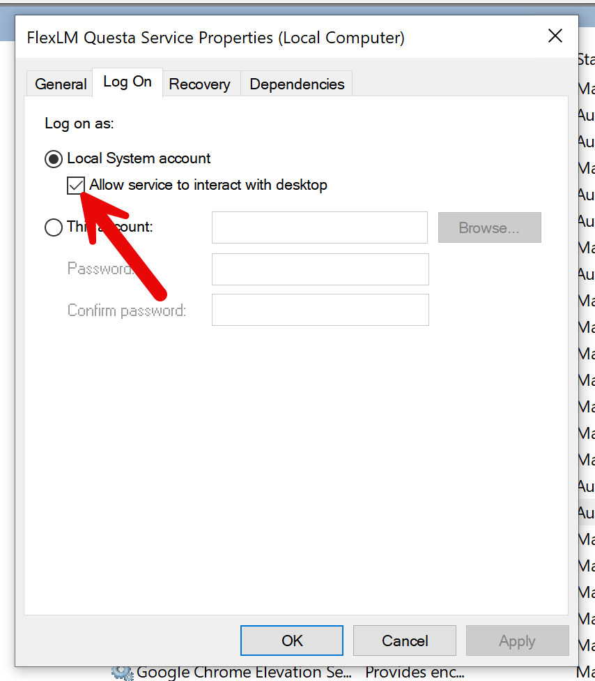

 6. Select the "Apply" button.

 7. Start the Service.

## Set the LM_LICENSE_FILE environment variable

The machine running Quartus/Questa needs to have the `LM_LICENSE_FILE` environment variable set to the license server. In this case, we're running the tools and the license server all on the same Windows machine.

1. Type `Edit the system environment variables` into the Windows search bar and hit enter.

2. Click on "Environment Variables"

   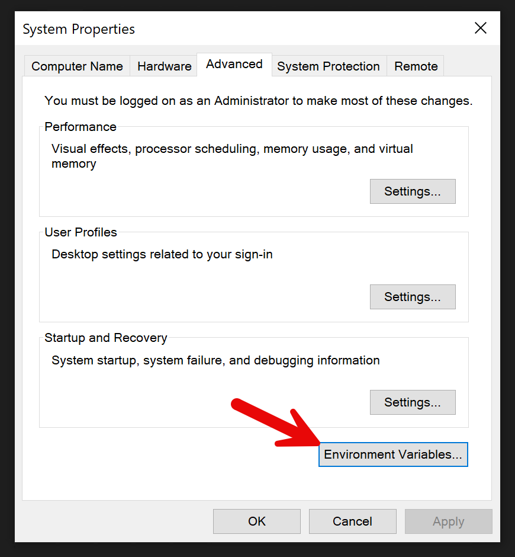

3. Under "System variables" click on "New" to add a new system environment variable

   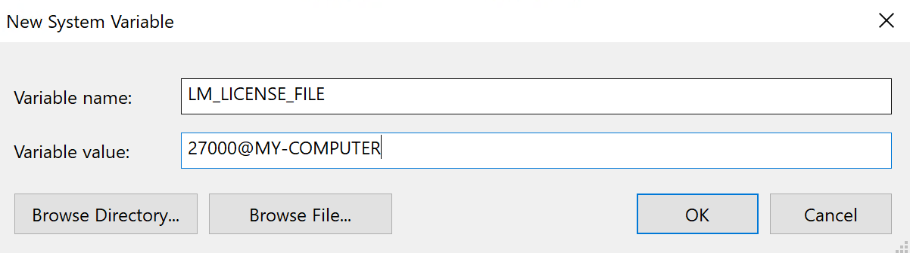

4. Click "OK" to save the new variable.

## Run Questa

You should now be able to run Questa from within a Remote Desktop session!

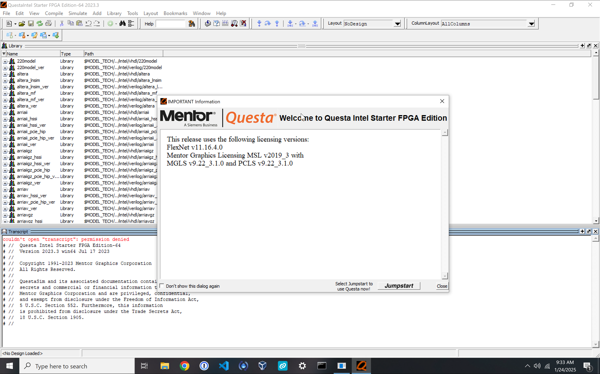

[^1]: It appears that newer versions of Questa require a path to `saltd` instead of `mgcld`. See https://www.intel.com/content/www/us/en/docs/programmable/683472/24-3/set-up-a-license-file-in-the-license-server.html for more details.
