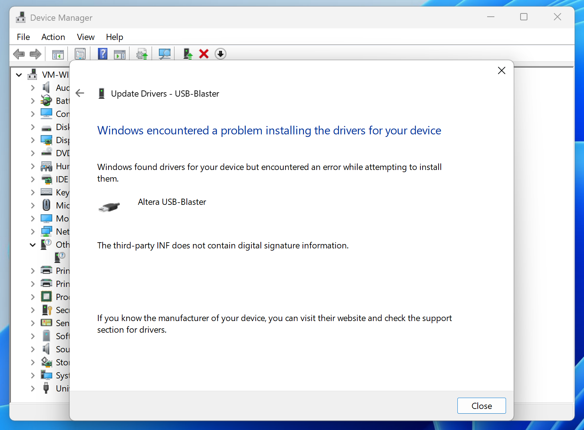

*Learn how to run Intel Quartus® Prime Lite Edition via Parallels on a Mac with Apple Silicon (ARM64)*

Yesterday's post [How to run Intel Quartus® Prime Lite Edition via Remote Desktop](https://cgnd.dev/posts/intel-quartus-prime-lite-edition-via-remote-desktop/) covered how to set-up and run the Quartus tools from a separate Windows machine via Remote Desktop.

This follow-up post covers how to install the exact same tools in a Windows VM running in Parallels on a Mac with Apple Silicon (ARM64). This is a nice alternative if you don't have an extra Windows machine available, or if you want to be able to edit Windows files directly from your Mac via Parallels file sharing.

The process for installing the tools is essentially the same as if you were installing them on an x86-64 Windows machine, except that the USB Blaster drivers bundled with Quartus do not work on an ARM-based machine.

## Install and License Quartus® Prime Lite Edition

If you haven't already, download and install [Intel® Quartus® Prime Lite Edition](https://fpgasoftware.intel.com/?edition=lite) in the Windows VM. In this guide I installed [Version 23.1.1 for Windows](https://www.intel.com/content/www/us/en/software-kit/825278/intel-quartus-prime-lite-edition-design-software-version-23-1-1-for-windows.html). You'll need to [sign in](https://www.intel.com/apps/intel/services/unifiedlogin.html) or [register](https://www.intel.com/content/www/us/en/secure/forms/developer/premier-registration.html) for an Intel account if you haven't already.

You can follow the [official Intel docs](https://www.intel.com/content/www/us/en/docs/programmable/683472/23-1/faq.html) to set up either a *node-locked* or *floating* license (or you can check out the [instructions from yesterday's post](https://cgnd.dev/posts/intel-quartus-prime-lite-edition-via-remote-desktop/#request-a-license) for setting up a floating license).



At the end of the installation, **uncheck** the box to "Launch USB Blaster II driver installation". This will prevent the x64 USB Blaster drivers from attempting to be installed in the ARM64 VM. In the next step, you will install the ARM64 USB Blaster drivers manually.



## ARM64 Windows Driver Download

Under the hood, the USB Blaster drivers are essentially just the official [FTDI D2XX drivers](https://ftdichip.com/drivers/d2xx-drivers/). FTDI provides an ARM64 driver for Windows that can be used to patch the x64 USB Blaster drivers to get them working on ARM64!

Here's a direct link to download the patched drivers from GitHub: [USB Blaster ARM64 Driver](https://github.com/jonpalmisc/usb_blaster_arm64/releases/download/v2.12.28%2C2.12.36.4/build.zip)

Alternatively, you can download the FTDI D2XX drivers and patch them yourself by following the instructions in this repository:

https://github.com/jonpalmisc/usb_blaster_arm64

## Install the ARM64 Driver

Attach the USB Blaster device to the Windows VM and open the device manager.

You should see the device listed in "Other devices". Right click and choose "Update driver".

Choose "Browse my computer for drivers" and install the driver downloaded from GitHub.



You will most likely encounter an error saying:

>  "The third-party INF does not contain digital signature information."

The driver needs to be installed with driver signature enforcement disabled.

In the Windows VM:

1. Go to Settings > System > Recovery
2. Click on "Restart now" by Advanced startup
3. Confirm Restart now
4. Select "Troubleshoot"
5. Select "Advanced options"
6. Select "Startup Settings"
7. Select "Restart"
8. Press "7" for "Disable driver signature enforcement"

When Windows boots up, repeat the driver installation process above to install the driver.



The installation should succeed and you should see the device listed under Universal Serial Bus controllers.

The next time you reboot windows, driver signature enforcement will be re-enabled.
