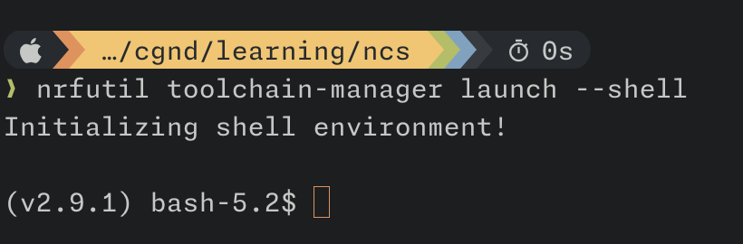
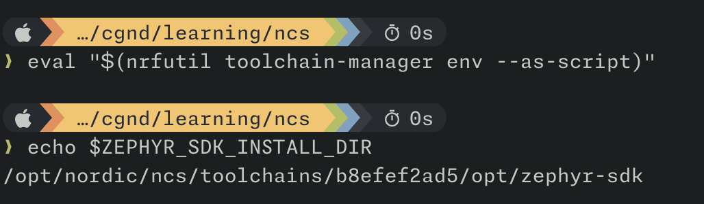

**[Today I learned](/series/today-i-learned/)** how to use the shell utility [direnv](https://direnv.net/) to automatically activate Zephyr build environments when working with West workspaces via the CLI.

Once direnv is configured, the build environment is automatically activated in the shell when entering the workspace directory. Similarly, when leaving the workspace directory, the build environment is automatically deactivated.

If you're like me, and your brain is a sieve, this will save you from having to remember to manually activate the python virtual environment and source the [required scripts](https://docs.zephyrproject.org/latest/develop/env_vars.html#zephyr-environment-scripts) to ensure the Zephyr environment variables are set correctly.

I'm going to show you how I set this up for Nordic's [nRF Connect SDK](https://www.nordicsemi.com/Products/Development-software/nRF-Connect-SDK) (NCS) and also for "vanilla" upstream [Zephyr RTOS](https://www.zephyrproject.org/) West workspaces.



Unfortunately, direnv only works on Unix-like operating systems (macOS, Linux, etc), and requires a supported shell (bash, zsh, tcsh, fish, elvish, powershell, murex, nushell).

Sorry Windows folks!



## nRF Connect SDK (NCS) Example

In recent versions of the nRF Connect SDK, Nordic recommends using their [nRF Util](https://www.nordicsemi.com/Products/Development-tools/nrf-util) CLI tool to manage the installation of toolchain bundles provided by Nordic.

Described as a *"unified command line utility for Nordic products"*, nRF Util (`nrfutil`) provides a wide range of functionality through a set of installable and upgradeable sub-commands. Specifically, the [`toolchain-manager`](https://docs.nordicsemi.com/bundle/nrfutil/page/nrfutil-toolchain-manager/nrfutil-toolchain-manager_0.15.0.html) command can be used to search for, install, and uninstall toolchains.

In addition to managing toolchains, the `toolchain-manager` command provides [`env` and `launch` sub-commands](https://docs.nordicsemi.com/bundle/nrfutil/page/nrfutil-toolchain-manager/nrfutil-toolchain-manager_0.15.0.html#starting-toolchain-environment) to activate a specific toolchain environment in the shell. For example, you can use the `nrfutil toolchain-manager env` to display the environment variables needed to configure the toolchain environment.

```plaintext
GIT_EXEC_PATH            : /opt/nordic/ncs/toolchains/b8efef2ad5/Cellar/git/2.37.3/libexec/git-core
GIT_TEMPLATE_DIR         : /opt/nordic/ncs/toolchains/b8efef2ad5/Cellar/git/2.37.3/share/git-core/templates
PATH                     : /opt/nordic/ncs/toolchains/b8efef2ad5/bin:/opt/nordic/ncs/toolchains/b8efef2ad5/usr/bin:/opt/nordic/ncs/toolchains/b8efef2ad5/usr/local/bin:/opt/nordic/ncs/toolchains/b8efef2ad5/opt/bin:/opt/nordic/ncs/toolchains/b8efef2ad5/opt/nanopb/generator-bin:/opt/nordic/ncs/toolchains/b8efef2ad5/opt/zephyr-sdk/arm-zephyr-eabi/bin:/opt/nordic/ncs/toolchains/b8efef2ad5/opt/zephyr-sdk/riscv64-zephyr-elf/bin:<redacted>
ZEPHYR_SDK_INSTALL_DIR   : /opt/nordic/ncs/toolchains/b8efef2ad5/opt/zephyr-sdk
ZEPHYR_TOOLCHAIN_VARIANT : zephyr
```

In the [Installing the nRF Connect SDK](https://docs.nordicsemi.com/bundle/ncs-latest/page/nrf/installation/install_ncs.html) documentation, Nordic recommends using the following command to activate the toolchain in a subshell:

```sh
nrfutil toolchain-manager launch --shell
```

Unfortunately, any shell configuration files (e.g. `.bashrc`) are skipped when launching this subshell:

> The shell spawned is determined by the `SHELL` environment variable. An attempt is made to spawn the shell without running any config files (e.g. ".bashrc"), as these files could (potentially) mess up the environment.
>
> Officially supported shells are: "bash", "pwsh" and "zsh". Other shells might still work, but these are spawned with no flags. Note: You can run any shell, with any number of flags, by passing the command directly (see [COMMAND]).

The result, as you can see in the image below, is that my custom shell prompt and other shell configuration is ignored when launching the new subshell:



As an alternative, the `nrfutil toolchain-manager env --as-script` command can output a script which sets up the same environment as the `launch --shell` sub-command:

```plaintext
❯ nrfutil toolchain-manager env --as-script
export PATH=/opt/nordic/ncs/toolchains/b8efef2ad5/bin:/opt/nordic/ncs/toolchains/b8efef2ad5/usr/bin:/opt/nordic/ncs/toolchains/b8efef2ad5/usr/local/bin:/opt/nordic/ncs/toolchains/b8efef2ad5/opt/bin:/opt/nordic/ncs/toolchains/b8efef2ad5/opt/nanopb/generator-bin:/opt/nordic/ncs/toolchains/b8efef2ad5/opt/zephyr-sdk/arm-zephyr-eabi/bin:/opt/nordic/ncs/toolchains/b8efef2ad5/opt/zephyr-sdk/riscv64-zephyr-elf/bin:$PATH
export GIT_EXEC_PATH=/opt/nordic/ncs/toolchains/b8efef2ad5/Cellar/git/2.37.3/libexec/git-core
export GIT_TEMPLATE_DIR=/opt/nordic/ncs/toolchains/b8efef2ad5/Cellar/git/2.37.3/share/git-core/templates
export ZEPHYR_TOOLCHAIN_VARIANT=zephyr
export ZEPHYR_SDK_INSTALL_DIR=/opt/nordic/ncs/toolchains/b8efef2ad5/opt/zephyr-sdk
```

By running `eval` on the output of that command, we can effectively activate the toolchain build environment *in the current shell* (without launching a new subshell):



Unfortunately, I will NEVER remember that command off the top of my head...and even if I did, I don't want to type it over and over again.

### Automate it with direnv

It would be nice if the toolchain just *automatically* activated whenever we're in a West workspace, and deactivated when we leave the workspace.

Lucky for us, [direnv](https://direnv.net/) is a general purpose shell utility designed to enable that exact type of behavior.

> Before each prompt, direnv checks for the existence of a `.envrc` file (and [optionally](https://direnv.net/man/direnv.toml.1.html#codeloaddotenvcode) a `.env` file) in the current and parent directories. If the file exists (and is authorized), it is loaded into a **bash** sub-shell and all exported variables are then captured by direnv and then made available to the current shell.

In the root of a West workspace, we can simply add a `.envrc` file with the following lines:

```sh
eval "$(nrfutil toolchain-manager env --as-script)"
source zephyr/zephyr-env.sh
```

Now, when we enter the workspace directory, direnv will automatically export the build environment variables into the current shell:

```plaintext
❯ cd ncs-workspace/
direnv: loading ncs-workspace/.envrc
direnv: export +GIT_EXEC_PATH +GIT_TEMPLATE_DIR +ZEPHYR_BASE +ZEPHYR_SDK_INSTALL_DIR +ZEPHYR_TOOLCHAIN_VARIANT ~PATH
```



For security purposes, direnv will not automatically load changes from an `.envrc` script unless it has been explicitly allowed. As a result, you may see an error like this the first time you enter the workspace:

```plaintext
direnv: error ncs-workspace/.envrc is blocked. Run `direnv allow` to approve its content
```

You just need to run `direnv allow` once to allow it to run.



## Upstream Zephyr Example

We can also use direnv to automatically activate build environments for "vanilla" Zephyr RTOS workspaces.

If you have worked with West workspaces via the command line, you're probably used to typing something like this to activate the build environment:

```sh
cd zephyr-workspace/

# activate the Python virtual environment
source .venv/bin/activate

# source Zephyr environment scripts
source zephyr/zephyr-env.sh
```

In the same vein as the NCS example above, we can add a `.envrc` file into the root of the West workspace with the following lines:

```sh
test -d .venv || source .venv/bin/activate
source zephyr/zephyr-env.sh
```

Now, whenever you `cd` into the `zephyr-workspace/` directory, the python virtual environment and the Zephyr environment scripts will be activated automatically!
