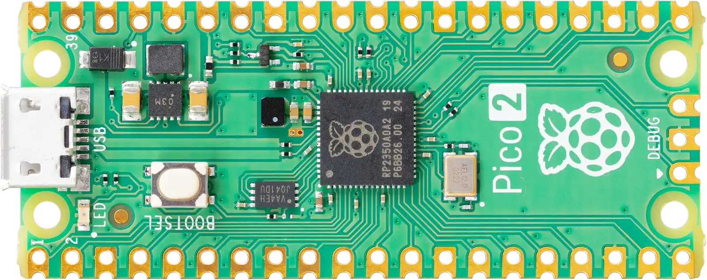
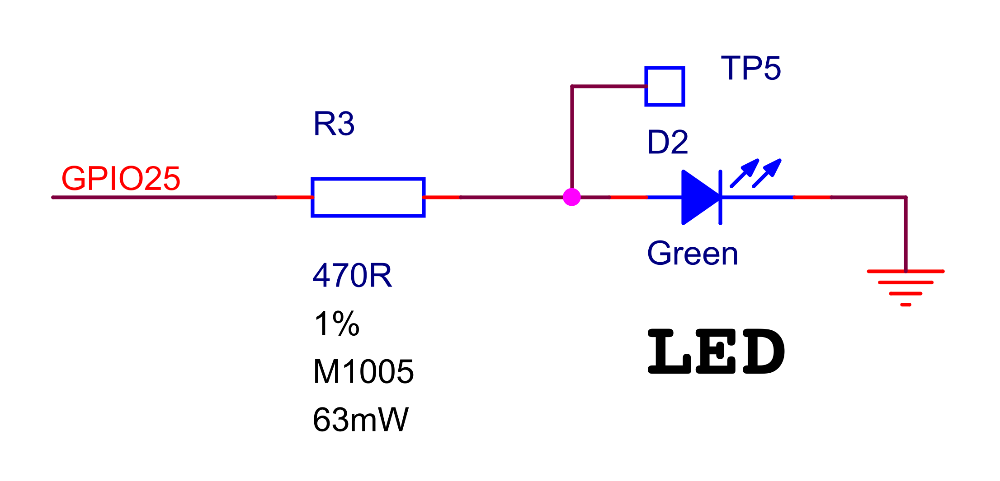
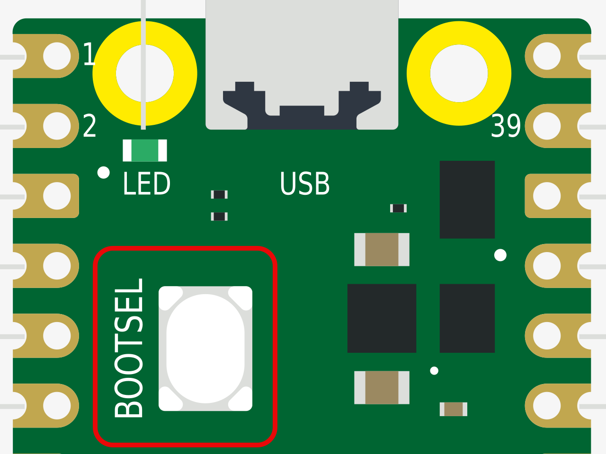
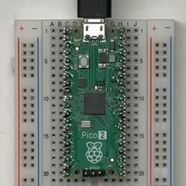
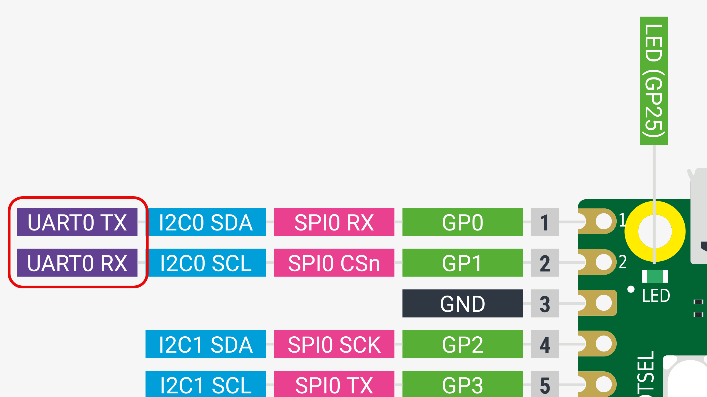

***Zero to (Greek) Hero: A quick start guide for running Zephyr RTOS on the Raspberry Pi Pico 2.***

In Greek mythology, Zephyr is the god of the 'westerly wind'—a soft, gentle breeze that heralds springtime. As we approach the first few days of spring here in the US, it's fitting that the west wind has blown in a fresh new release of the [Zephyr Project](https://www.zephyrproject.org/) 🌬️🪁

March 7, 2025 marked the version 4.1.0 release of the popular RTOS framework. This release includes a massive set of [new enhancements and features](https://zephyrproject.org/zephyr-rtos-4-1-is-available/), but one of the improvements I'm most excited about is support for the [Raspberry Pi Pico 2](https://docs.zephyrproject.org/latest/boards/raspberrypi/rpi_pico2/doc/index.html#rpi_pico2) board.



For less than the price of a cup of pretentious coffee, you can get started developing with Zephyr RTOS on the latest [RP2350](https://www.raspberrypi.com/products/rp2350/) MCU from Raspberry Pi—you don't even need an external debugger to flash the firmware on the board.

However, while the Pico 2 hardware is priced for accessibility, Zephyr's reputation for having a steep learning curve may deter some new developers from exploring the project. The flexibility and configurability that make Zephyr so powerful can seem overwhelming when you are just trying to figure out how to get a single LED to blink on your new Pico 2 board.

**Fear not. In this post, I'll provide step-by-step instructions on how to get started using Zephyr on the Pico 2 board.**

This post is intended as a focused quick start guide to getting Zephyr running on the Pico 2 board as fast as possible. By the end, you should have a basic understanding of how to build, flash, and interfact with Zephyr firmware running on the Pico 2. The only thing required to follow along with this post is a $5 Pico 2 board and a micro USB cable.

First, I'll cover how to install the Zephyr toolchain and SDK. We'll use the toolchain and SDK to build the `blinky` sample app and verify that the hardware and build environment is working correctly. Next, I'll show how to modify the `blinky` sample app to enable the CDC-ACM virtual serial console over the USB port (so you don't need to use an external USB-to-serial adapter). Finally, I'll walk through how to use the Zephyr shell to read sensor values from a simulated sensor device.

In a follow-up post, I'll demonstrate how to create a basic Zephyr app from scratch. We'll wire up an external sensor device to the board and learn how to display real sensor readings via the Zephyr shell.



Before we dive in, it's worth pointing out a couple limitations in the current Zephyr support for the board:

- The Zephyr build only supports configuring the RP2350A with the Cortex-M33 cores.
- As with the Pico 1, there’s no support for running any code on the second core.



## Set up the development environment

In order to build Zephyr firmware for the Pico 2 board, we need to set up a development environment. This includes downloading the [Zephyr source code](https://github.com/zephyrproject-rtos/zephyr) (and it's dependencies), as well as the toolchains (i.e. the "[Zephyr SDK](https://docs.zephyrproject.org/latest/develop/toolchains/zephyr_sdk.html#toolchain-zephyr-sdk)") which include a compiler, assembler, linker, and other programs required to build Zephyr apps for the RP2350 chip on the Pico 2.

The Zephyr Project documentation includes a step-by-step guide for setting up a command-line development environment on macOS, Windows, and Linux operating systems. Follow the initial steps in the official [Getting Started Guide](https://docs.zephyrproject.org/latest/develop/getting_started/index.html), but stop when you get to the section titled "[Build the Blinky Sample](https://docs.zephyrproject.org/latest/develop/getting_started/index.html#build-the-blinky-sample)". There are some changes required for the Pico 2 board which I'll walk through in detail in the sections below.



The getting started guide will instruct you to install the `west` command line tool. [West](https://docs.zephyrproject.org/latest/develop/west/index.html) is an extensible "a swiss-army knife command line tool" that is used for repository management, building firmware, and interacting with devices (flashing, erasing, etc). Instead of downloading each git repository manually, west will download and manage all the dependencies for you.



## Build the Blinky sample

When you get to the [Build the Blinky Sample](https://docs.zephyrproject.org/latest/develop/getting_started/index.html#build-the-blinky-sample) section of the Getting Started Guide, you'll be instructed to run a build command like the following:

```sh
cd ~/zephyrproject/zephyr
west build -p always -b <your-board-name> samples/basic/blinky
```

At this point, you might be wondering "how can we build the same blinky app for *any* board? Don't we need to edit the sample code to define which GPIO pin is connected to the LED?"

From the schematic, we can see that the Pico 2 board has a green onboard LED that is connected to `GPIO25`:



However, the [`samples/basic/blinky/src/main.c`](https://github.com/zephyrproject-rtos/zephyr/blob/main/samples/basic/blinky/src/main.c) file doesn't make any mention of `GPIO25` or whether the LED is active high or active low. How does the firmware know how to toggle the correct GPIO for the LED?

Similar to the approach taken by Linux, the hardware definition and initial configuration for each board are stored in a data structure called the [devicetree](https://docs.zephyrproject.org/latest/build/dts/index.html), which is defined separately from the application code. All the hardware on the Pico 2 board is described in a set of devicetree source files—[here's the specific line that defines the LED](https://github.com/zephyrproject-rtos/zephyr/blob/20faa0e1142144526475261b550222d2312caf43/boards/raspberrypi/common/rpi_pico-led.dtsi#L12). We'll dig into the devicetree in more detail later in Part 2, but for now, you just need to know that the devicetree definitions are what tells the generic blinky app how to toggle a designated LED for each supported board.

Since the RP2350A has both ARM Cortex-M33 and Hazard3 RISC-V cores, the west build command needs to know which core to target when building the firmware. Despite the name `<your-board-name>`, this argument is actually a hierarchical identifier made up of the board name and a set of board qualifiers which include the SoC name and CPU cluster.

The [Raspberry Pi Pico 2](https://docs.zephyrproject.org/latest/boards/raspberrypi/rpi_pico2/doc/index.html#rpi_pico2) Zephyr documentation page lists the "board name" argument needed for this command as `rpi_pico2/rp2350a/m33` (you can also find it from the list of supported boards by running `west boards`). The following command will build the blinky firmware for the main ARM Cortex-M33 core in the RP2350A:

```sh
west build -p always -b rpi_pico2/rp2350a/m33 samples/basic/blinky
```

The `-p always` option tells Zephyr to perform a "pristine" build, which wipes out any existing `build/` directory and builds the app by recompiling all the sources.

If everything built correctly, you should see a final line in the output like the following:

```plaintext
Wrote 32768 bytes to zephyr.uf2
```

This firmware file is located at `build/zephyr/zephyr.uf2` and is ready to be flashed to the board.

## Flash the Blinky sample

The RP2350A has a built-in [UF2](https://github.com/microsoft/uf2) bootloader which can be used to flash the `zephyr.uf2` firmware onto the board over the USB connection.



It's also possible to flash the firmware using an external debug probe like the [Raspberry Pi Debug Probe](https://www.raspberrypi.com/products/debug-probe/) or a [Segger J-Link](https://www.segger.com/debug-trace-embedded-systems/), but programming the board via UF2 does not require any additional hardware or external connections to the board.



Make sure the Pico 2 board is unplugged and hold down the `BOOTSEL` button on the board:



Plug in the USB cable with the `BOOTSEL` button pressed. You should see a mass storage device appear on your computer named `RP2350`.

To flash the firmware onto the board, the `zephyr.uf2` firmware file must be copied into the `RP2350` drive. Instead of copying the file manually, west has a UF2 "runner" option that will copy the file to the board automatically.

Run the following west flash command to flash the firmware to the board:

```sh
west flash -r uf2
```

If everything was successful, you should see the LED in the top left of the board blinking once a second.



At this point, we've verified that the build environment, flashing process, and the hardware is working as expected. Next, we'll work on getting the serial console working.

## Build the Blinky sample with CDC-ACM UART

If you took a look at the `blinky/src/main.c` source, you may have noticed [a line which prints out the LED state](https://github.com/zephyrproject-rtos/zephyr/blob/20faa0e1142144526475261b550222d2312caf43/samples/basic/blinky/src/main.c#L44):

```c
printf("LED state: %s\n", led_state ? "ON" : "OFF");
```

Where does this output go?

By default, the Zephyr console is [mapped to the default UART peripheral (UART0)](https://github.com/zephyrproject-rtos/zephyr/blob/20faa0e1142144526475261b550222d2312caf43/boards/raspberrypi/rpi_pico2/rpi_pico2.dtsi#L19) on the Pico 2 board.



If you were to connect a USB-to-Serial adapter to the `UART0 TX` & `UART 0 RX` pins on the Pico 2 board (default serial port settings are 115200 8-N-1), you would see serial output like the following:

```plaintext
*** Booting Zephyr OS build v4.1.0 ***
LED state: OFF
LED state: ON
LED state: OFF
LED state: ON
...
```

Since we're already programming the board via the USB port, it would be nice to be able to run the console over the USB port as well, rather than having to connect an external serial adapter.

Fortunately, Zephyr allows us to easily redirect the console from `UART0` to a CDC-ACM virtual UART device using one of the built-in [Snippets](https://docs.zephyrproject.org/latest/build/snippets/index.html). At this point, you don't need to know the details of how Snippets work, just that they are a way to predefine a set of build settings and apply them to an app at build time. In this case, we'll specify the [CDC-ACM Console Snippet](https://docs.zephyrproject.org/latest/snippets/cdc-acm-console/README.html) (`-S cdc-acm-console`) when building the `blinky` app.



We also need to specify the [`CONFIG_USB_DEVICE_INITIALIZE_AT_BOOT`](https://docs.zephyrproject.org/latest/kconfig.html#CONFIG_USB_DEVICE_INITIALIZE_AT_BOOT) KConfig option to tell Zephyr to initialize USB device support at boot. Normally, your app would perform this USB initialization explicitly, but the `blinky` sample app we're building does not do this for us automatically. We'll discuss [KConfig](https://docs.zephyrproject.org/latest/build/kconfig/index.html) (Zephyr's configuration system) in more detail in Part 2, so don't worry too much about this option right now.



```sh
west build -p always -b rpi_pico2/rp2350a/m33 -S cdc-acm-console samples/basic/blinky -- -DCONFIG_USB_DEVICE_INITIALIZE_AT_BOOT=y
```

Use the same process described earlier to flash the firmware to the board: unplug the USB cable, hold down the `BOOTSEL` button, plug the USB cable back in, and wait for the `RP2350` drive to appear.

Flash the firmware to the board.

```sh
west flash -r uf2
```

When the board resets, you should see a new USB CDC-ACM serial device enumerate on your PC. For example, on my Mac, it shows up as `/dev/cu.usbmodem31323201`.

Open this device in your serial terminal of choice (e.g. `picocom`), and you should see the LED state printed to the console each second.

```plaintext
❯ picocom /dev/cu.usbmodem31323201
...
*** Booting Zephyr OS build v4.1.0 ***
LED state: OFF
LED state: ON
LED state: OFF
LED state: ON
...
```

When we discuss building a custom Zephyr app in Part 2, we'll use this CDC-ACM serial device for printing messages to the console.

## Using the Zephyr shell

One of the most powerful "batteries included" features of Zephyr is the [Shell Subsystem](https://docs.zephyrproject.org/latest/services/shell/index.html#shell-api). Like most aspects of Zephyr, the shell is extremely configurable, with the ability to combine built-in and custom commands for each app. Zephyr ships with a variety of built-in shell commands for interacting with the various Zephyr subsystems.

For example, the `i2c` shell command group provides subcommands for interacting with an I2C bus:

```plaintext
uart:~$ i2c help
i2c - I2C commands
Subcommands:
  scan         : Scan I2C devices
                 Usage: scan <device>
  recover      : Recover I2C bus
                 Usage: recover <device>
  read         : Read bytes from an I2C device
                 Usage: read <device> <addr> <reg> [<bytes>]
  read_byte    : Read a byte from an I2C device
                 Usage: read_byte <device> <addr> <reg>
  direct_read  : Read byte stream directly from an I2C device without writing a
                 register address first
                 Usage: direct_read <device> <addr> [<bytes>]
  write        : Write bytes to an I2C device
                 Usage: write <device> <addr> <reg> [<byte1>, ...]
  write_byte   : Write a byte to an I2C device
                 Usage: write_byte <device> <addr> <reg> <value>
  speed        : Configure I2C bus speed
                 Usage: speed <device> <speed>
```

In this section, we'll build Zephyr's [`sensor_shell`](https://zephyr-docs.listenai.com/samples/sensor/sensor_shell/README.html) sample app. Since there aren't any built-in sensors on the Pico 2 board, we'll enable a fake sensor so that you can get comfortable using the `sensor` shell subcommand.



The `-DEXTRA_DTC_OVERLAY_FILE=fake_sensor.overlay` argument adds a fake sensor device to the device tree for the board. Don't worry about the details of how this works for now, we'll discuss the devicetree in more detail later on in Part 2.



Build and flash the `sensor_shell` app:

```sh
west build -p always -b rpi_pico2/rp2350a/m33 -S cdc-acm-console samples/sensor/sensor_shell/ -- -DCONFIG_USB_DEVICE_INITIALIZE_AT_BOOT=y -DEXTRA_DTC_OVERLAY_FILE=fake_sensor.overlay
west flash -r uf2 # remember to put the board into UF2 bootloader mode
```

Once the board boots up, you'll see the shell prompt in the console. Type `help` to show a list of commands.

```plaintext
uart:~$ help
Please press the <Tab> button to see all available commands.
You can also use the <Tab> button to prompt or auto-complete all commands or its subcommands.
You can try to call commands with <-h> or <--help> parameter for more information.

Shell supports following meta-keys:
  Ctrl + (a key from: abcdefklnpuw)
  Alt  + (a key from: bf)
Please refer to shell documentation for more details.

Available commands:
  clear    : Clear screen.
  device   : Device commands
  devmem   : Read/write physical memory
             Usage:
             Read memory at address with optional width:
             devmem <address> [<width>]
             Write memory at address with mandatory width and value:
             devmem <address> <width> <value>
  help     : Prints the help message.
  history  : Command history.
  kernel   : Kernel commands
  rem      : Ignore lines beginning with 'rem '
  resize   : Console gets terminal screen size or assumes default in case the
             readout fails. It must be executed after each terminal width change
             to ensure correct text display.
  retval   : Print return value of most recent command
  sensor   : Sensor commands
  shell    : Useful, not Unix-like shell commands.
```

We'll use the `sensor` shell command to read the fake sensor device we enabled earlier. Typing `sensor` without any subcommands prints out the help for the `sensor` command.

```plaintext
uart:~$ sensor
sensor - Sensor commands
Subcommands:
  get       : Get sensor data. Channel names are optional. All channels are read
              when no channels are provided. Syntax:
              <device_name> <channel name 0> .. <channel name N>
  attr_set  : Set the sensor's channel attribute.
              <device_name> <channel_name> <attribute_name> <value>
  attr_get  : Get the sensor's channel attribute. Syntax:
              <device_name> [<channel_name 0> <attribute_name 0> ..
              <channel_name N> <attribute_name N>]
  info      : Get sensor info, such as vendor and model name, for all sensors.
  trig      : Get or set the trigger type on a sensor. Currently only supports
              `data_ready`.
              <device_name> <on/off> <trigger_name>
```

The help text indicates that we need to use the `get` subcommand with the name of a sensor device. We can get a list of the available devices using the `device list` subcommand.

```plaintext
uart:~$ device list
devices:
- clock-controller@40010000 (READY)
  DT node labels: clocks
- reset-controller@40020000 (READY)
  DT node labels: reset
- snippet_cdc_acm_console_uart (READY)
  DT node labels: snippet_cdc_acm_console_uart
- uart@40070000 (READY)
  DT node labels: uart0 pico_serial
- gpio@40028000 (READY)
  DT node labels: gpio0
- sensor@1 (READY)
  DT node labels: vsensor1
- sensor@0 (READY)
  DT node labels: vsensor0
```

The last two devices in the list `vsensor0` and `vsensor1` are the fake sensor devices.

Now that we know the names of the fake sensors, we can use them to read the sensor values. Zephyr's sensor subsystem uses the concept of [Sensor Channels](https://docs.zephyrproject.org/latest/hardware/peripherals/sensor/channels.html) to define a standard interface for quantities that a sensor device can measure. For example, any sensor that measures ambient temperature, pressure and humidity will use the same three channels: `ambient_temp`, `press`, and `humidity`. If we don't specify a specific channel name to read, the `sensor get <device>` command will print out *all* the channels for the device. For the fake sensor we enabled, this is a LOT of channels.

```plaintext
uart:~$ sensor get vsensor1 ambient_temp
channel type=13(ambient_temp) index=0 shift=4 num_samples=1 value=111686672803ns (13.000000)
uart:~$ sensor get vsensor1
channel type=0(accel_x) index=0 shift=6 num_samples=1 value=29374384785ns (0.000000)
channel type=1(accel_y) index=0 shift=6 num_samples=1 value=29374384785ns (1.000000)
channel type=2(accel_z) index=0 shift=6 num_samples=1 value=29374384785ns (2.000000)
channel type=3(accel_xyz) index=0 shift=6 num_samples=1 value=29374384785ns, (0.000000, 1.000000, 2.000000)
channel type=4(gyro_x) index=0 shift=6 num_samples=1 value=29374384785ns (4.000000)
... <LOTS more channels>
```

Instead, let's specify the exact set of channels we want to get. For example, to get the ambient temperature, pressure, and humidity, we can specify the `ambient_temp`, `press`, and `humidity` channels.

```plaintext
uart:~$ sensor get vsensor1 ambient_temp press humidity
channel type=13(ambient_temp) index=0 shift=5 num_samples=1 value=118297198604ns (13.000000)
channel type=14(press) index=0 shift=5 num_samples=1 value=118297198604ns (14.000000)
channel type=16(humidity) index=0 shift=5 num_samples=1 value=118297198604ns (16.000000)
```

Later on, when we build a custom Zephyr app in Part 2, we'll wire up a real external sensor to the board and read its sensor values using the same `sensor` shell command.

## Next Steps - Part 2

So far, we've been building sample apps directly out of the main Zephyr git repository. This is great for testing out the functionality of various Zephyr subsystems without having to write any code.

However, when developing your own Zephyr apps, you'll typically work on them in the context of a [West Workspace](https://docs.zephyrproject.org/latest/develop/west/workspaces.html) and version control them separately in their own git repository.

Stay tuned for a follow-up "Part 2" post where I'll demonstrate how to create a basic Zephyr app for the Pico 2 from scratch. We'll wire up an external sensor device to the board and learn how to display real sensor readings via the Zephyr shell.

## Feedback

If you liked the "Quick Start" style of this post, or if there are additional topics you'd like me to cover in a follow-up post for the Pico 2, let me know in the comments below.
