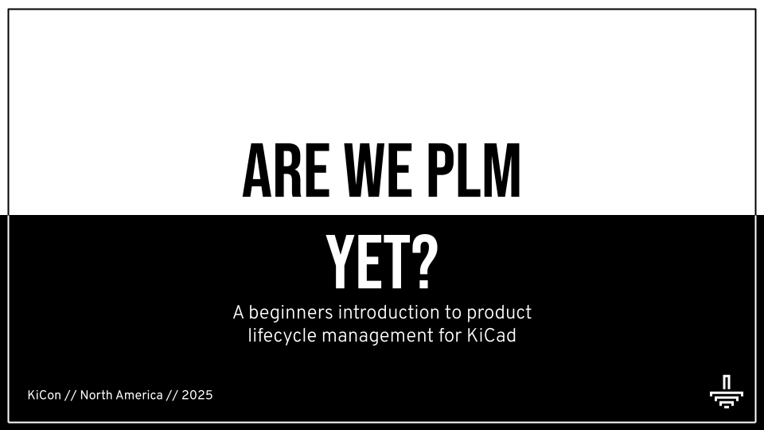

## I'm speaking at KiCon this year!

Have you ever wondered how product teams manage BOMs, revisions, releases, and specifications over the lifecycle of a hardware product?

In this talk, you’ll learn the basics of using Product Lifecycle Management (PLM) software with KiCad. I'll walk through how to integrate a KiCad database library with Aligni, a cloud-based PLM software offering a free tier for open-source hardware organizations.

https://pretalx.kicad.org/kicon-na-2025/talk/H3VMQY/

## Talk Slides

 [KiCon 2025 North America - KiCad PLM Talk - v1.1.pdf](<KiCon 2025 (North America) - KiCad PLM Talk - v1.1.pdf>)

## Conference Livestream

### Day 1



### Day 2


