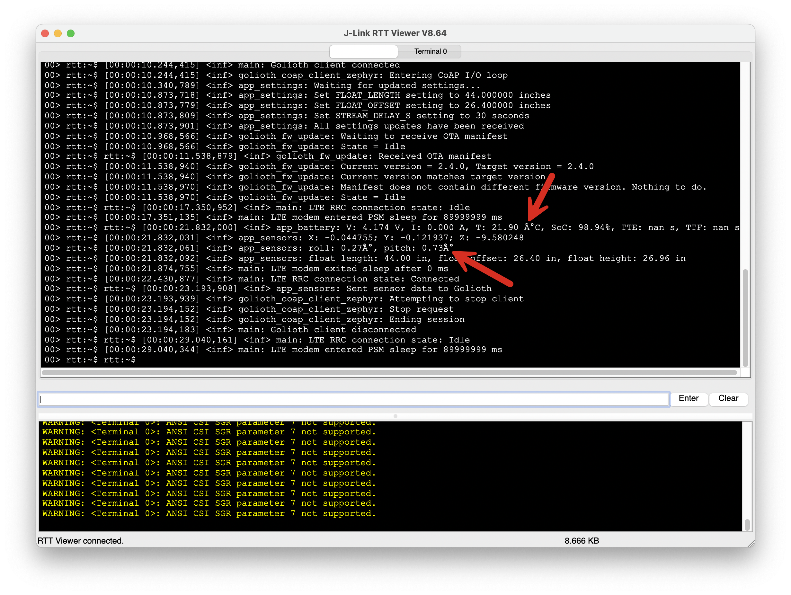
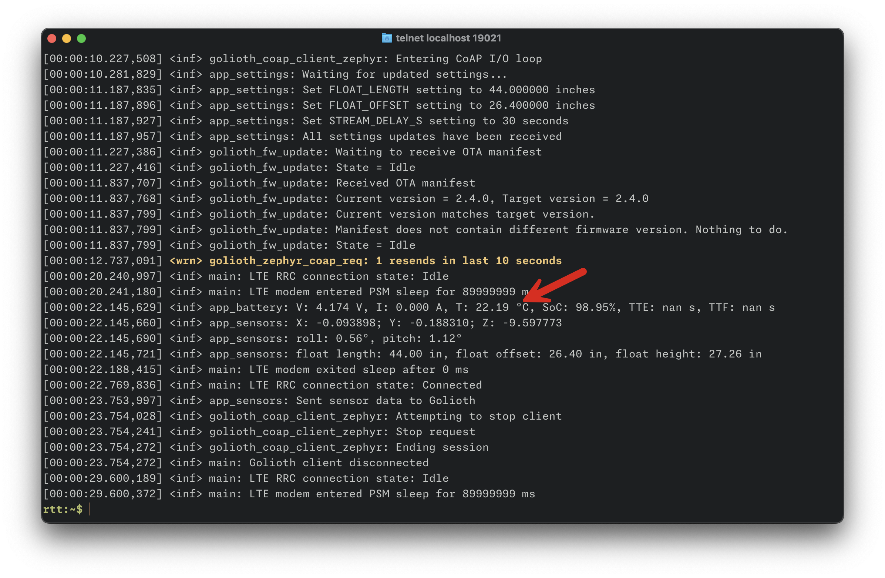



This post is part of a new series of short-form posts titled **[Today I learned](/series/today-i-learned/)**. These posts are intended to be short and more informal—my goal is for you to learn one thing quickly.



Segger's [Real Time Transfer (RTT)](https://www.segger.com/products/debug-probes/j-link/technology/about-real-time-transfer/) feels like magic 🪄, but their RTT viewer application feels like you're stuck back in the 1980's 📟.

For example: fonts are not configurable, there's a clunky line-based input, and it only works with Latin1 (ISO/IEC 8859-1) encoded strings. If your device is sending UTF-8 characters to the RTT console, you get garbled output for multi-byte characters.



But... we don't have to live this way! **Today I learned you can use RTT without the Viewer app.**

Here's how it works. RTT is implemented as a client/server model which allows client devices to connect to the RTT server via telnet.

First, you start the Segger RTT server. The command below will automatically connect to a Nordic nRF9151 device via SWD on a J-Link with serial number `1196000003`.

```sh
JLinkExe -NoGui 1 -If SWD -Speed 4000 -Device NRF9151_XXCA -AutoConnect 1 -USB 1196000003 -RTTTelnetPort 19021
```

Once the server is running, you can connect to it via telnet.

```sh
telnet localhost 19021
```

Since the RTT client is running in a nice terminal emulator ([Ghostty](https://ghostty.org/)), it automatically uses my terminal font ([monaspace](https://monaspace.githubnext.com/)) and color theme. The Zephyr shell can be used in character mode without a clunky line mode input box. And UTF-8 characters are handled properly too!





I had better success with the Zephyr shell when I switched telnet into character mode by typing the escape character `^]` and running the command `mode character`.

```plaintext
rtt:~$ ^]
telnet> mode character
```



Alternatively, if you don't have `telnet`, Segger includes a command line client application [JLinkRTTClient](https://kb.segger.com/J-Link_RTT_Client) that acts as a telnet client and connects directly to the RTT server.

```sh
JLinkRTTClient -LocalEcho Off
```

If you're using [Zephyr](https://www.zephyrproject.org/), things should be even simpler. The `west rtt` command should configure RTT automatically. For more info, check out the [Zephyr Shell docs](https://docs.zephyrproject.org/latest/services/shell/index.html#segger-rtt).



When I tried this today with a Nordic Thingy:91 X and the v3.1.0 release of NCS, I got the following error when running `west rtt`:

```plaintext
ERROR: runners.jlink: [Errno 22] Invalid argument
```

If you want to follow along to see what's causing this error, I submitted a support ticket to Nordic's DevZone:

<https://devzone.nordicsemi.com/f/nordic-q-a/124331/invalid-argument-error-when-running-west-rtt-with-nrf9151>

If you know how to fix this or what I'm doing wrong, let me know in the comments below!



Happy debugging! 🐞
